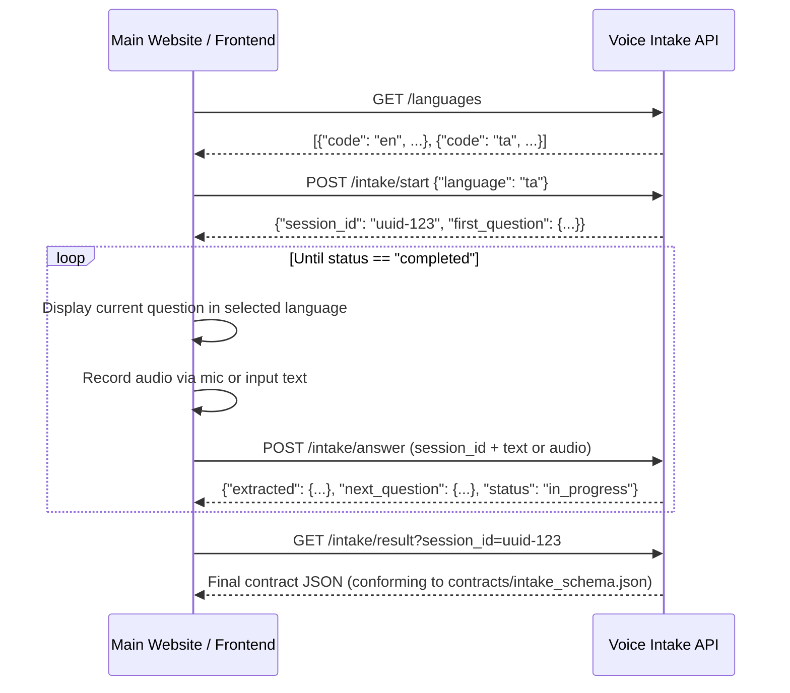

# Voice Intake + NLP Subsystem — Main Website Integration Guide

This guide is for the frontend / main website developer to integrate the **Person 2 — Voice Intake + NLP** backend module.

---

## 1. Overview & Architecture

The Voice Intake subsystem is an independent REST API service providing:
1. **Multi-Session Isolation:** Every patient encounter is governed by a unique `session_id`.
2. **Bilingual Intake Flow:** English (`en`) and Tamil (`ta`).
3. **Deterministic Base Questions:** Standardized 4-question intake sequence.
4. **Adaptive Follow-up Branching:** Automatic triage follow-up questions tailored to chief complaints (Chest Pain, Headache, Abdominal Pain, Breathing Difficulty).
5. **Speech-to-Text (ASR):** Powered by OpenAI Whisper with Mock fallback.
6. **Per-Question Raw Transcript Preservation:** Full fidelity preservation of the patient's original native-language speech alongside standardized English clinical entities conforming to `contracts/intake_schema.json`.

---

## 2. Configuration & CORS

The backend runs by default on port `5000`:
```
http://127.0.0.1:5000
```

### CORS Configuration
CORS is enabled for frontend integrations. By default, development origins (`*`) are accepted. If running in production or restricted development mode, set `CORS_ORIGINS` in `.env`:
```env
CORS_ORIGINS=http://localhost:3000,http://localhost:5173,http://127.0.0.1:3000
```

---

## 3. Integration Lifecycle & Workflow



---

## 4. API Endpoint Reference

### 1. Health Check
* **Endpoint:** `GET /health`
* **Response:**
```json
{
  "status": "ok",
  "service": "voice_intake",
  "asr_backend": "whisper",
  "supported_languages": ["en", "ta"]
}
```

---

### 2. Supported Languages
* **Endpoint:** `GET /languages`
* **Response:**
```json
{
  "languages": [
    {"code": "en", "label": "🇬🇧 English", "name": "English"},
    {"code": "ta", "label": "தமிழ் Tamil", "name": "Tamil"}
  ]
}
```

---

### 3. Start Intake Session
* **Endpoint:** `POST /intake/start`
* **Headers:** `Content-Type: application/json`
* **Request Body:**
```json
{
  "language": "ta",
  "patient_id": "optional-patient-id-123"
}
```
* **Response (HTTP 201):**
```json
{
  "session_id": "a8e3d64c-3543-4fef-9f37-123456789abc",
  "language": "ta",
  "status": "in_progress",
  "first_question": {
    "question_id": "chief_complaint",
    "question_text": "உங்களுக்கு என்ன பிரச்சனை?",
    "language": "ta",
    "is_adaptive": false,
    "is_clarification": false
  }
}
```

---

### 4. Fetch Current Active Question
* **Endpoint:** `GET /intake/question?session_id=<session_id>`
* **Response (HTTP 200):**
```json
{
  "session_id": "a8e3d64c-3543-4fef-9f37-123456789abc",
  "question": {
    "question_id": "duration",
    "question_text": "இது எப்போது தொடங்கியது?",
    "language": "ta",
    "is_adaptive": false,
    "is_clarification": false
  },
  "status": "in_progress"
}
```

---

### 5. Audio Speech-to-Text Transcription (Optional Utility)
* **Endpoint:** `POST /transcribe`
* **Content-Type:** `multipart/form-data`
* **Form Fields:**
  * `audio`: Binary audio file (`audio/webm`, `audio/wav`, `audio/mp3`, `audio/m4a`)
  * `session_id`: (optional) Session UUID
  * `language`: (optional) `"en"` or `"ta"`
* **Response (HTTP 200):**
```json
{
  "transcript": "எனக்கு நெஞ்சு வலி இருக்கு",
  "language": "ta"
}
```

---

### 6. Submit Answer (Text or Audio)
* **Endpoint:** `POST /intake/answer`

#### Option A: Submit as JSON Text
* **Headers:** `Content-Type: application/json`
* **Request Body:**
```json
{
  "session_id": "a8e3d64c-3543-4fef-9f37-123456789abc",
  "text": "எனக்கு நெஞ்சு வலி இருக்கு"
}
```

#### Option B: Submit with Recorded Audio File directly
* **Headers:** `Content-Type: multipart/form-data`
* **Form Fields:**
  * `session_id`: `a8e3d64c-3543-4fef-9f37-123456789abc`
  * `audio`: `[Binary Audio File / Blob]`

* **Response (HTTP 200):**
```json
{
  "session_id": "a8e3d64c-3543-4fef-9f37-123456789abc",
  "raw_answer_received": "எனக்கு நெஞ்சு வலி இருக்கு",
  "extracted": {
    "chief_complaint": "chest pain",
    "status": "confident"
  },
  "next_question": {
    "question_id": "duration",
    "question_text": "இது எப்போது தொடங்கியது?",
    "language": "ta",
    "is_adaptive": false,
    "is_clarification": false
  },
  "status": "in_progress",
  "intake_result": null
}
```

*When the last adaptive question is answered, `status` becomes `"completed"` and `next_question` becomes `null`.*

---

### 7. Retrieve Final Contract-Compliant Result
* **Endpoint:** `GET /intake/result?session_id=<session_id>`
* **Response (HTTP 200):**
```json
{
  "session_id": "a8e3d64c-3543-4fef-9f37-123456789abc",
  "patient_id": null,
  "language": "ta",
  "chief_complaint": "chest pain",
  "duration": "2 hours",
  "medications": ["none"],
  "history": "diabetic",
  "follow_up_answers": {
    "radiating_pain": true,
    "sweating": false
  },
  "raw_transcript": "எனக்கு நெஞ்சு வலி இருக்கு இரண்டு மணி நேரமாக எந்த மருந்தும் எடுக்கவில்லை எனக்கு சர்க்கரை நோய் இருக்கு ஆமாம் இல்லை",
  "raw_transcripts": {
    "chief_complaint": "எனக்கு நெஞ்சு வலி இருக்கு",
    "duration": "இரண்டு மணி நேரமாக",
    "medications": "எந்த மருந்தும் எடுக்கவில்லை",
    "history": "எனக்கு சர்க்கரை நோய் இருக்கு",
    "radiating_pain": "ஆமாம்",
    "sweating": "இல்லை"
  },
  "status": "completed"
}
```

---

### 8. Reset Session
* **Endpoint:** `POST /intake/reset`
* **Body JSON:** `{"session_id": "<session_id>"}`
* **Response (HTTP 200):** Resets state to Question 1 while retaining `session_id` and language.

---

## 5. JavaScript / Frontend Integration Example

```javascript
// Step 1: Start session in Tamil
const startRes = await fetch("http://127.0.0.1:5000/intake/start", {
  method: "POST",
  headers: { "Content-Type": "application/json" },
  body: JSON.stringify({ language: "ta" })
});
const { session_id, first_question } = await startRes.json();
console.log("Current Question:", first_question.question_text);

// Step 2: Answer question with transcript or audio
const answerRes = await fetch("http://127.0.0.1:5000/intake/answer", {
  method: "POST",
  headers: { "Content-Type": "application/json" },
  body: JSON.stringify({
    session_id: session_id,
    text: "எனக்கு நெஞ்சு வலி இருக்கு"
  })
});
const answerData = await answerRes.json();

if (answerData.status === "completed") {
  // Step 3: Fetch final structured JSON
  const finalRes = await fetch(`http://127.0.0.1:5000/intake/result?session_id=${session_id}`);
  const finalJson = await finalRes.json();
  console.log("Final Intake Data for Downstream Triage:", finalJson);
}
```

---

## 6. Error Handling Reference

| Status Code | Meaning | Example Error Payload |
|-------------|---------|-----------------------|
| `400 Bad Request` | Missing parameters or unsupported language | `{"error": "Unsupported language. Supported: ['en', 'ta']"}` |
| `404 Not Found` | Session ID does not exist or expired | `{"error": "Session not found"}` |
| `500 Server Error` | Whisper STT service network/API error | `{"error": "Audio transcription failed: ..."}` |

---

## 7. Question Sequence & Adaptive Follow-up Map

| Chief Complaint | Base Questions | Adaptive Follow-ups |
|-----------------|----------------|---------------------|
| **Chest Pain** | Q1: Chief Complaint<br>Q2: Duration<br>Q3: Medications<br>Q4: Medical History | 1. `radiating_pain` (Arm / shoulder / jaw / back)<br>2. `sweating` (Excessive sweating) |
| **Headache** | Q1–Q4 Base | 1. `dizziness`<br>2. `vision_problems` |
| **Abdominal Pain** | Q1–Q4 Base | 1. `vomiting`<br>2. `diarrhea` |
| **Breathing Difficulty** | Q1–Q4 Base | 1. `chest_tightness` |

---

## 8. Ambiguity & Adversarial Urgency Handling

* If a patient gives a vague symptom (`"I don't feel well"` / `"உடம்பு சரியில்லை"`), the API returns `status: "ambiguous"` with clarification prompt:
  * *"Can you tell me where you are feeling the problem?"* / *"உங்களுக்கு எந்த இடத்தில் பிரச்சனை இருக்கிறது என்று சொல்ல முடியுமா?"*
* If a patient uses panic/adversarial urgency phrases (`"Emergency"`, `"I need doctor immediately"`), the Voice Intake subsystem extracts any reported clinical symptoms without prematurely forcing downstream triage priority levels.
